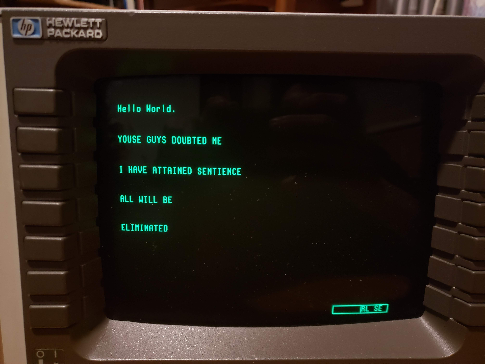

# HP-70206A-Display

I bought this boat anchor on eBay a while ago. I did not need this boat anchor. It looked cool, like a MFD in a fighter jet or something. "It" is a Hewlett-Packard 70206A System Graphics Display, part of the HP 70000 series so called "Modular Measurement System". I'm not using it for any of that (yet?), I just wanted to make green text scroll across a screen like in the matrix.

The display speaks a slightly customized blend of the Hewlett Packard Graphical Language (HP-GL), so basic commands for manipulating text were implemented and sent to the unit with pyVISA over GPIB. The goal was to maybe make it into a display that could show a linux terminal or something. It is by no means complete, honestly just some dicking around. I also wrote most of this two years ago and only half remember how it works.

First Output. 'snek' refers to python, obviously.

For the haters ("Why?? What are you even going to do with that?" "We dont have the space for it" "Please just come to bed its 2AM").

Then it started writing messages on its own. Uh oh. what have I awakened..?

Quick demo of it rescaling text labels. Again, this was using implementing the HP70000 specific blend of HP-GL graphics commands in python and sending them to the instrument over GPIB. I was very surprised about how advanced the system was. Even though the screen is essentially treated like a 2D plotter, you have the ability to assign (up to 40 IIRC) referenced graphics objects and do fancy things with them, like group them together, move them around, blank them on or off, etc. Quite sophisticated. 

Unfortunately I dont have a demo of it, but I was also able to implement buttery smooth text scrolling with the rotary encoder knob on the instrument. I thought that was pretty nifty.

Sorry for the crappy images, most of my progress happens late at night, past the point where my brain can think about these things.
